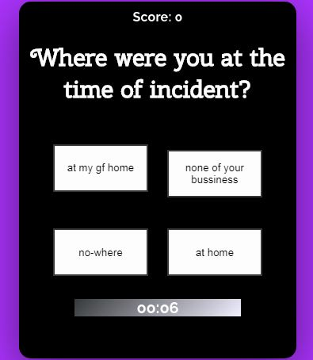
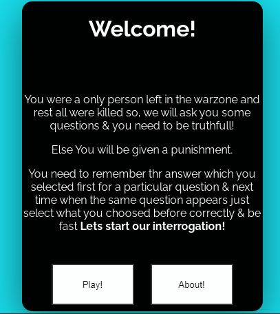

# Interrogation-game

This is a interrogation game made in pure javascript.

# Introduction

This game is Vanilla Javascript Clone of an awesome game Indefinite by branden li which crossed over 500K + downloads on google play store.

Uses concepts of Array mostly and recursive approach.
play here: http://anicode.in/Interrogation-game/

if you want to contribute then you may be go for **pull requests**.

The game is live at [github](https://abhiprojectz.github.io/Interrogation-game/)

# Preview 

Don't forget to give it a star!

Thanks.
